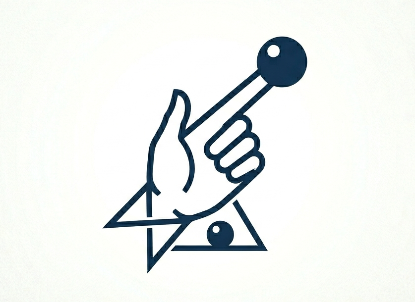

<div align="center">
  
  
  <h1>Handzy</h1>
  <p><b>Control your Android device hands-free using MediaPipe-powered gesture recognition.</b></p>

  <p>
    <a href="https://flutter.dev"></a>
    <a href="https://developer.android.com/"></a>
    <a href="https://github.com/google/mediapipe"></a>
  </p>
</div>

---

## 🌟 Overview

**Handzy** is an innovative Android application that leverages on-device machine learning (Google's MediaPipe) to track hand landmarks in real-time. By utilizing the Android Accessibility Service, Handzy translates physical hand gestures into system-wide touch controls—allowing you to navigate, scroll, and click without ever touching the screen.

## ✨ Features

- **👆 Pinch to Click**: Bring your thumb and middle finger together to simulate a quick screen tap.
- **✊ Fist to Scroll**: Form a closed fist to seamlessly scroll through web pages, social media, and system menus.
- **⚡ Low Latency**: Native C++ MediaPipe integration runs efficiently on edge devices.
- **🔒 Privacy First**: Zero network tracking. Handzy operates entirely offline (the `INTERNET` permission has been explicitly removed from the Android Manifest).

---

## 🚀 Installation & Usage

### Prerequisites
- An Android device running **Android 8.0 (API 26)** or higher.
- Front-facing camera.

### Setup Guide (Sideloading & Android 13+)

Since Handzy utilizes powerful Accessibility APIs outside of the Google Play Store, later versions of Android require a specific manual bypass to enable it.

1. Install the `Handzy-release.apk` on your device.
2. **Crucial step for Android 13+**: 
   - Open your device's **Settings** > **Apps** > **Handzy**.
   - Tap the three dots (**⋮**) in the top right corner.
   - Select **"Allow restricted settings"**.
3. Navigate to **Settings** > **Accessibility** > **Handzy** and toggle the service **ON**.
4. Open the Handzy app and grant the required **Camera permissions**.
5. Prop your phone up, step back, and start gesturing!

---

## 🛠️ Building from Source

To build this project from source, you will need the [Flutter SDK](https://docs.flutter.dev/get-started/install) installed.

### 1. Clone & Install Dependencies
```bash
git clone https://github.com/yourusername/Handzy.git
cd Handzy
flutter clean
flutter pub get
```

### 2. Build Release APK
```bash
flutter build apk --release
```
*(Note: Code minification/R8 is deliberately disabled in `android/app/build.gradle` for release builds to prevent aggressive shrinking from stripping MediaPipe's C++ bindings).*

---

## 🧠 Architecture Overview

Handzy operates through a hybrid bridge system:
*   **Frontend**: Flutter / Dart (Provides the camera preview and status interface).
*   **Vision Processing**: Google MediaPipe Solutions (Tracks 21 3D hand/knuckle landmarks).
*   **System Control**: Android `AccessibilityService` (Kotlin-based platform bridge that injects gesture coordinates into the Android OS as native touch inputs).

---

## 📄 License

This project is open-source and distributed under the **MIT License**. See the `LICENSE` file for details.
